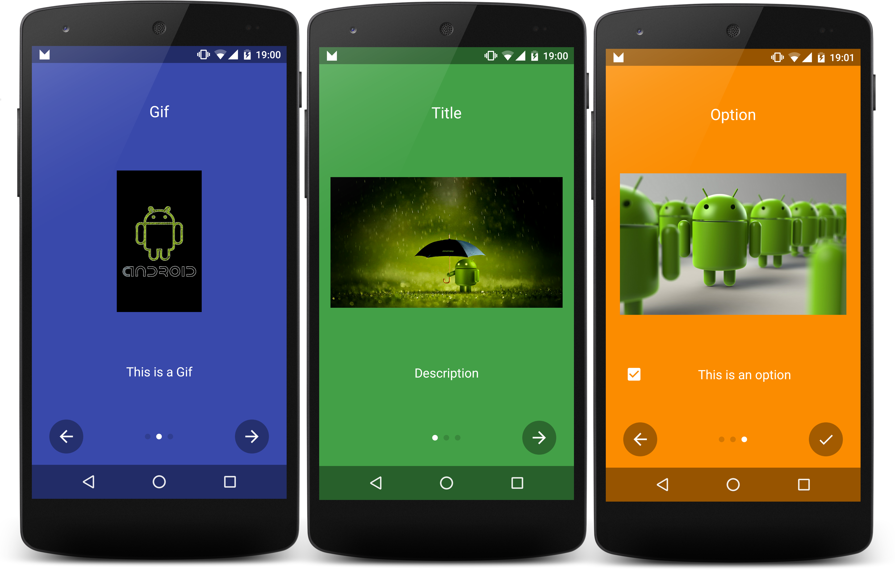

# Introduction [  ](https://bintray.com/rubengees/maven/Introduction/_latestVersion) [](https://www.apache.org/licenses/LICENSE-2.0)
[](http://www.android-gems.com/lib/RubenGees/Introduction)
[](http://android-arsenal.com/details/1/2498)
[](https://android-libs.com/lib/introduction?utm_source=github-badge&utm_medium=github-badge&utm_campaign=github-badge)

Show a beautiful Intro to your users with ease.



### Include in your Project

Add this to your build.gradle:

```groovy
repositories {
    maven { url "https://jitpack.io" }
}

dependencies {
    compile ('com.github.RubenGees:Introduction:1.1.2'){
        transitive = true;
    }
}
```

If that doesn't work, look if there is a new version and the Readme was not updated yet.

If you want to use asynchronous image loading, introduced in the new version 1.1.0, you will need [Glide](https://github.com/bumptech/glide) or some other image loading library. If you want to use GIFs you will also need it.

### Usage

Create an `IntroductionBuilder` like the following:

```java
new IntroductionBuilder(this) //this is the Activity you want to start from.
```

Then add some Slides to your Introduction:

```java
new IntroductionBuilder(this).withSlides(generateSlides())
```

```java
 private List<Slide> generateSlides() {
      List<Slide> result = new ArrayList<>();

       result.add(new Slide().withTitle("Some title").withDescription("Some description").
               withColorResource(R.color.green).withImage(R.drawable.myImage));
       result.add(new Slide().withTitle("Another title").withDescription("Another description")
               .withColorResource(R.color.indigo).withImage(R.drawable.myImage2));

       return result;
    }
```

Finally introduce yourself!

```java
new IntroductionBuilder(this).withSlides(generateSlides()).introduceMyself();
```

That was easy right?

You can do many customizations, which will be covered by the following.

##### Options

You can let the user make decisions, which you can use like settings.
To do that you add an Option to your slide:

```java
new Slide().withTitle("Feature is doing something").withOption(new Option("Enable the feature"))
          .withColorResource(R.color.orange).withImage(R.drawable.image));
```

When the user completes the intro, you will receive the selected Options in `onActivityResult`. 
To read the result:

```java
@Override
protected void onActivityResult(int requestCode, int resultCode, Intent data) {
     if (requestCode == IntroductionBuilder.INTRODUCTION_REQUEST_CODE &&
            resultCode == RESULT_OK) {
         String result = "User chose: ";

         for (Option option : data.<Option>getParcelableArrayListExtra(IntroductionActivity.
                 OPTION_RESULT)) {
            result += option.getPosition() //The position of the Slide
                       + (option.isActivated() ? " enabled" : " disabled");
        }
     }
}
```

The constant value of the requst is 32142, so don't use that yourself.
It is possible that the user cancels the intro. If that happens, the resultCode is `RESULT_CANCELLED` and no Options are passed back.

##### Use Gifs as images

This library supports GIFs. You need to load them asynchronously as the loading may take a while:

```java
new IntroductionBuilder(this).withSlides(slides)
                .withOnSlideListener(new OnSlideListener() {
                    @Override
                    protected void onSlideInit(Fragment context, int position, TextView title,
                                               ImageView image, TextView description) {
                        if (position == 1) { //Assume we want to load the GIF at Slide 2 (index 1)
                            Glide.with(context).load(R.drawable.image3).into(image);
                        }

                    }
                }).introduceMyself();
```

This will add the GIF, which will be automatically played when the users navigates to the Slide.

##### Runtime Premissions

Android Marshmallow introduced Runtime Permissions, which can be requested easily with this lib.
To do that, you can add a global listener like the following:

```java
new IntroductionBuilder(this).withSlides(slides)
                .withOnSlideListener(new OnSlideListener() {
                    @Override
                    public void onSlideChanged(int from, int to) {
                        if (from == 0 && to == 1) {
                            if (ActivityCompat.checkSelfPermission(MainActivity.this,
                                    Manifest.permission.WRITE_EXTERNAL_STORAGE)
                                    != PackageManager.PERMISSION_GRANTED) {
                                ActivityCompat.requestPermissions(MainActivity.this,
                                        new String[]{Manifest.permission.WRITE_EXTERNAL_STORAGE},
                                        12);
                            }
                        }
                    }
                }).introduceMyself();
```

You can check if the permissions were granted like the following:

```java
@Override
public void onRequestPermissionsResult(int requestCode, @NonNull String[] permissions,
                                       @NonNull int[] grantResults) {
    super.onRequestPermissionsResult(requestCode, permissions, grantResults);

     if (requestCode == 12) {
         if (grantResults[0] == PackageManager.PERMISSION_GRANTED) {
            Toast.makeText(this, "Permission was successfully granted!", Toast.LENGTH_LONG)
                     .show();
        }
    }
}
```

You can use that listener for different things too, of course!

##### Styles

There are two available styles: `Translucent` and `Fullscreen`.
To apply one of those styles, do the following:

```java
new IntroductionBuilder(this).withSlides(generateSlides())
                .withStyle(IntroductionBuilder.STYLE_FULLSCREEN).introduceMyself();
```

`Translucent` is the default style.

##### Further reading

A much more detailed explanation with all available APIs can be found in the [Wiki](https://github.com/RubenGees/Introduction/wiki).

### Minimum Sdk

The minimum required sdk is 10 (2.3.3 Gingerbread)

### Upgrade Guide

#### 1.1.0 to 1.1.1+

- The 'OnSlideInit' method in the `OnSlideListener` now comes without the `Fragment context`. If you need a `Context`, call `image.getContext()`.
- There is now a class for Styles instead of an Integer. If you apply no Style, you have to do nothing, if you use one, change it to the following e.g.: `.withStyle(new FullscreenStyle())`. 

#### 1.0.x to 1.1.0+

- The 'OnSlideChangedListener' was renamed to 'OnSlideListener'. Just rename it and it's working again.
- Asynchronous image loading is now available (and recomended!). See the 'Use GIFs as drawables' section for more info. It applies for all types of images. GIFs won't work without asynchronous loading from now on!

### Libraries used in this project

- [SystemBarTint](https://github.com/jgilfelt/SystemBarTint) For the translucent style.

### Acknowledgments

The images in the samples are taken from the following webpages (I do not own any of the images, all rights are reserved to their respective owners):

- [image1.jpg](https://www.flickr.com/photos/rbulmahn/6180104944/in/photolist-89W1PC-8Q713U-9BussZ-cwr9kY-9XzRzZ-83z8K5-84k3xS-adM5Y9-drdDdf-e1wXZE-6kzXBW-aq7DTw-98qbVd-83w6aa-6TYUqy-bttVPE-jPnPwv-83zc5G-9mgbHk-bmJtgf-c8f3yC-6T4zxf-83jUyV-9WRbGQ-6RrUxc-6oHoaj-7Z2YXE-oveaff-8rNmyh-f95MK4-8EFVd6-kiJrYR-9Y8USW-9qC58Z-o7ZmL9-ovdL7H-oMHywk-oMFMME-oMrEw4-oMHy8e-ovaLae-ovaL5K-ovaL2t-ovaKLZ-oMoBJr-89SKWD-89W1Bu-89SKwT-89SKwa-89W1kG)
- [image2.jpg](https://www.flickr.com/photos/uncalno/8538679708/in/photolist-e1wXZE-6kzXBW-aq7DTw-98qbVd-83w6aa-6TYUqy-bttVPE-jPnPwv-83zc5G-9mgbHk-bmJtgf-c8f3yC-6T4zxf-83jUyV-9WRbGQ-6RrUxc-6oHoaj-7Z2YXE-oveaff-8rNmyh-f95MK4-8EFVd6-kiJrYR-9Y8USW-9qC58Z-o7ZmL9-ovdL7H-oMHywk-oMFMME-oMrEw4-oMHy8e-ovaLae-ovaL5K-ovaL2t-ovaKLZ-oMoBJr-89SKWD-89W1Bu-89SKwT-89SKwa-89W1kG-89W1kb-89W1jN-89W15E-89VZRs-89VZDb-9kUiFS-9957fA-ehs7zp-5yFrKB)
- [image3.gif](http://www.modaco.com/forums/topic/344506-android-startshutdown-animation-for-i900/)

Some images and ideas are from this Repo: [AppIntro by Paolo Rotolo](https://github.com/PaoloRotolo/AppIntro)
